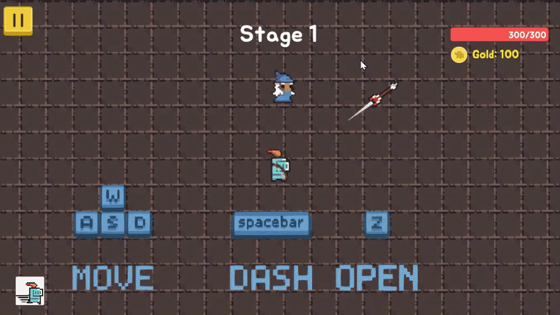
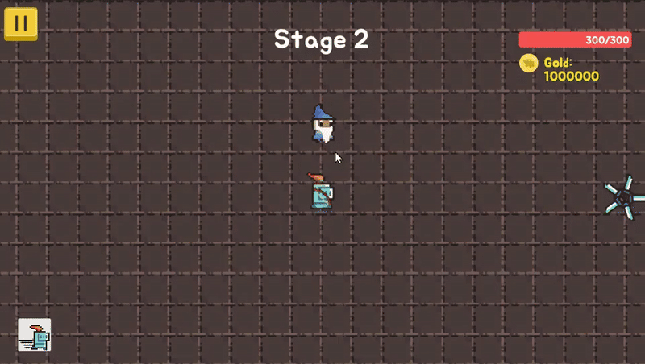
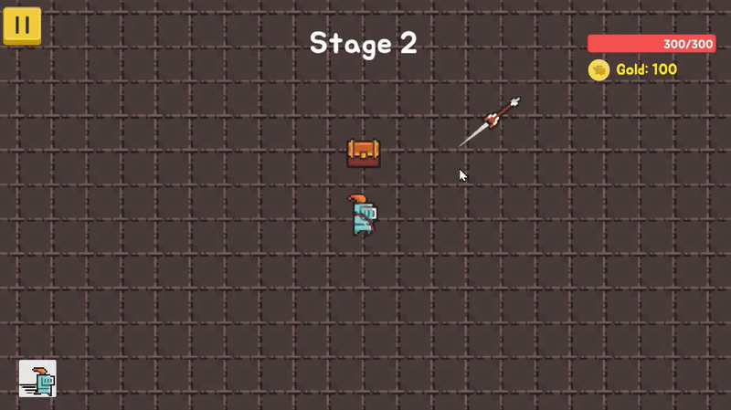

# 🌟 7조의 전설 (Legend of Team 7)

> Unity로 개발된 슈팅 로그라이크 액션 게임  
> 다양한 스킬, 퀘스트, 보스 패턴을 통해 몰입감 있는 플레이 제공

---

## 🎮 게임 정보

- **게임 이름**: 7조의 전설  
- **장르**: 슈팅 게임, 로그라이크  
- **개발 환경**: Unity 2022.3.2f1  
- **개발 기간**: 2025.05.07 ~ 2025.05.15

---

## 🕹️ 조작법

| 키 | 동작 |
|---|---|
| `WASD` | 이동 |
| `Space` | 대시 스킬 |
| `Z` | 아이템 상자 상호작용 |

---

## ⚙️ 주요 기능

### 📜 초반 스토리

- 인트로 연출과 함께 게임 세계관 소개

### 🗺️ 퀘스트

- NPC와 상호작용해 퀘스트 수락 및 완료  

### 🏹 다양한 스킬 강화

- **스킬 종류**: 빠른 사격, 연속 사격, 환영 활, 지뢰 화살, 빙결 화살, 관통 화살, 칼날 분열, 추적 화살  

### 🛒 무기 상점

- 무기 구매 시 자동 장착  

### 👾 몬스터 소환

- 스테이지가 진행될수록 웨이브 증가, 다양한 종류의 몬스터 등장  

### 🧠 9가지의 보스 패턴

- 이동 속도 증가, 몬스터 추가 소환, 카메라 반전, 공격 속도 증가, 빨간 장판 공격, 레이저 공격, 강제 이동, 아이템 생성, 랜덤 패턴 조합  

### 💊 아이템 획득

- **회복 및 능력 강화 아이템**:  
  - 체력 회복, 이동 속도 증가, 공격 속도 증가  

### 🧩 엔딩 분기

- **클리어 시**: 정상 엔딩  
- **사망 시**: 대체 스토리 엔딩 제공

---

## 🛠️ 사용 기술 스택

| 기술 | 설명 |
|---|---|
| 각도 보정형 화살 발사 | 화살이 부채꼴 형태로 퍼지도록 구현 |
| 제네릭 팝업 팩토리 | UI 확장성을 위한 리소스 기반 팩토리 패턴 |
| 오브젝트 풀링 | 스킬/몬스터 최적화를 위한 풀링 시스템 |
| 충돌 검사 + 거리 필터링 | 장애물 간 간격 보장 |
| 코루틴 | 스토리 대사 애니메이션 연출 |
| 제너릭 싱글톤 클래스 | 다양한 관리 클래스의 싱글톤 패턴 구현 |

---

## 🧩 트러블슈팅

- 📄 [슈팅 중 화면 버벅임 문제](./TroubleShooting/Screenstutters.md)
- 📄 [오브젝트 풀링 및 보스 스킬 반환 문제](./TroubleShooting/ObectpoolingBossSkillReturn.md)
- 📄 [StageResult 중복 팝업 문제](./TroubleShooting/StageResultDuplicatePopup.md)
- 📄 [장애물 중복 생성 시 겹침 문제](./TroubleShooting/ObstacleOverlap.md)
- 📄 [투명 벽에서 이동 불가 문제](./TroubleShooting/CantMoveThroughTransparentWalls.md)

---

## 👥 만든 사람들

| 이름 | 담당 역할 |
|---|---|
| **이시율** (팀장) | 플레이어 이동, 스킬 및 스킬 강화, 포션 아이템 기능 |
| **최진안** | UI 전반, 튜토리얼, 스킬 선택 시스템 |
| **임예슬** | 맵/스테이지 구성, 몬스터 구현 |
| **이서형** | 무기 상점 구현, 퀘스트 시스템, 오디오 |
| **신한빛** | 보스 몬스터 및 패턴, 게임 인트로/아웃트로, 스토리 기획 |

---
